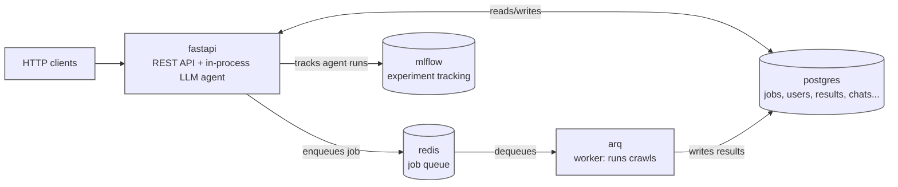

# OneCrawler Backend

[](https://www.python.org/)
[](https://fastapi.tiangolo.com/)
[](https://www.postgresql.org/)
[](https://redis.io/)
[](https://www.docker.com/)
[](LICENSE)

FastAPI backend for **OneCrawler**, a web crawling and content-extraction platform. It exposes a REST API for auth, crawl jobs, settings, and extracted data, and runs the crawling work through an async queue backed by [`onecrawler`](https://pypi.org/project/onecrawler/). It also ships an in-process LLM agent that drives this same REST API via tool calling — see [docs/agent.md](docs/agent.md).

## Architecture



API and worker are separate containers from the same [Dockerfile](Dockerfile), built at different targets:

- **`api`** — REST API plus the deepharness agent (`src/agent/`, in-process, no extra hop). Never imports `onecrawler` or launches a browser.
- **`worker`** — drives `onecrawler` + Playwright, so it installs the `onecrawler` package and Chromium.

A one-off **`migrate`** service runs `alembic upgrade head` before `fastapi`/`arq` start.

## Tech Stack

| Concern | Choice |
| --- | --- |
| Web framework | [FastAPI](https://fastapi.tiangolo.com/) + Uvicorn |
| ORM / DB | SQLAlchemy 2.0 (async) + asyncpg, PostgreSQL 16 |
| Job queue | [arq](https://arq-docs.helpmanual.io/) (Redis-backed) |
| Migrations | Alembic |
| Auth | JWT access + refresh tokens (PyJWT), Argon2 hashing |
| Validation | Pydantic v2 |
| Crawling engine | [`onecrawler`](https://pypi.org/project/onecrawler/) (Playwright-based) |
| LLM agent | [deepharness](https://sayedshaun.github.io/deepharness/), traced via [MLflow](https://mlflow.org/) |
| Lint / format | ruff, ruff-format, docformatter (pre-commit) |

Requires Python 3.12+.

## Project Structure

```
main.py            FastAPI entrypoint (lifespan, middleware, router mounts)
src/
├── api/
│   ├── security/    JWT auth dependency + /verify
│   ├── users/       register, login, logout, refresh, account, sessions
│   └── v1/          agent (chat + settings), crawler, dashboard, data, settings
├── core/            config, security, sessions, arq pool, logger
├── db/              SQLAlchemy models + async engine/session
├── worker/          arq WorkerSettings, settings_builder, crawl tasks
└── agent/           deepharness agent engine (see docs/agent.md)
alembic/             migrations
docs/                agent.md (agent architecture), apis.md (route index)
tests/               pytest + httpx.AsyncClient suites
```

## Getting Started

Requires Docker + Docker Compose, or Python 3.12+ with PostgreSQL 16 and Redis 7 natively.

```bash
cp .env.example .env
# at minimum, set a real JWT_SECRET_KEY before anything but local dev
docker compose up --build
```

This starts `postgres`, `redis`, `mlflow`, runs migrations, then `fastapi` (http://localhost:8000) and the `arq` worker. A default admin is seeded on first boot from `DEFAULT_ADMIN_*`.

**Live reload** — [`docker-compose.dev.yml`](docker-compose.dev.yml) bind-mounts the repo and runs `uvicorn --reload`:

```bash
docker compose -f docker-compose.yml -f docker-compose.dev.yml up
```

The `arq` worker deliberately doesn't hot-reload (job processes shouldn't restart mid-run) — use `docker compose restart arq`. The dev overlay also starts `ngrok` tunnelling `fastapi` to a public URL; set `NGROK_AUTHTOKEN` and check `http://localhost:4040`.

**Without Docker:**

```bash
python -m venv .venv && source .venv/bin/activate
pip install -e .[worker]                  # omit [worker] for API only
playwright install chromium --with-deps   # only to actually run crawls
cp .env.example .env                      # point POSTGRES_HOST / REDIS_URL at local services
alembic upgrade head
uvicorn main:app --reload
arq src.worker.settings.WorkerSettings    # in another shell
```

## Configuration

All config is environment variables (`.env`, loaded by `src/core/config.py`). See [`.env.example`](.env.example) for the annotated list; the essentials:

| Variable | Purpose | Default |
| --- | --- | --- |
| `POSTGRES_USER` / `_PASSWORD` / `_DB` | Postgres credentials | `onecrawler` |
| `POSTGRES_HOST` / `_PORT` | Postgres connection (compose service name in Docker) | `postgres` / `5432` |
| `REDIS_URL` | Redis connection for arq's queue | `redis://redis:6379/0` |
| `JWT_SECRET_KEY` | Token signing key — **change outside local dev** | `dev-secret-change-me` |
| `ACCESS_TOKEN_EXPIRE_MINUTES` / `REFRESH_TOKEN_EXPIRE_DAYS` | Token lifetimes | `60` / `30` |
| `DEFAULT_ADMIN_NAME` / `_EMAIL` / `_PASSWORD` | Seeded admin (only if that email has no user) | see `.env.example` |
| `CORS_ORIGINS` | JSON array of allowed origins | `["http://localhost:5173"]` |
| `LOG_LEVEL` | Root logging level for API and worker | `INFO` |
| `*_HOST_PORT` | Host-side port overrides for compose | commented out |
| `NGROK_AUTHTOKEN` | Dev-only tunnel token | unset |

Agent-specific `MLFLOW_*` / `AGENT_API_BASE_URL` are documented in [docs/agent.md](docs/agent.md#configuration) — same `src/core/config.py`, no separate file.

Generate a real key with `python -c "import secrets; print(secrets.token_urlsafe(64))"`.

## Logging

`src/core/logger.py` configures the root logger with a rotating file handler at `logs/app.log` (20MB, 3 backups) and a console handler, at `LOG_LEVEL`. `logs/` isn't a mounted volume, so file logs are lost when a container is recreated — use `docker compose logs` for anything that must survive that.

## Database Migrations

```bash
alembic upgrade head                 # apply all
alembic revision -m "description"    # new empty migration
alembic downgrade -1                 # roll back one
```

Migrations live in [`alembic/versions/`](alembic/versions/) and run automatically via the `migrate` service.

## Authentication

JWT Bearer tokens (`Authorization: Bearer <token>`): a short-lived **access token** plus a longer-lived **refresh token**, issued together by `POST /api/users/login`.

- Access tokens expire after `ACCESS_TOKEN_EXPIRE_MINUTES` and are individually revocable via a Redis blocklist keyed on the token's `jti` (how logout works).
- Refresh tokens exchange for a new pair at `POST /api/users/refresh`. Each is a row in `refresh_sessions`, which is what makes per-session listing and revocation possible under `/api/users/me/sessions`.
- Refreshing **rotates** the token — the used one is revoked, so a stolen refresh token stops working the next time the real owner refreshes. Changing a password revokes every session.

In Swagger (`/docs`): call `POST /api/users/login`, copy `accessToken`, click **Authorize**, and paste the raw token (no `Bearer ` prefix).

## API Reference

Interactive docs at `/docs` (Swagger UI) and `/redoc`; raw spec at `/openapi.json`. [docs/apis.md](docs/apis.md) has a route index grouped by area.

## Crawl Modes, Strategies & Filters

A crawl job (`POST /api/v1/crawls`) picks one **mode**: `sitemap` (discover URLs from the sitemap), `link_extraction` (follow links `shallow` or `deep`), or `crawler` (full crawl + extraction, streaming `CrawlResultItem` rows).

For `crawler` mode, `scraping_strategy` decides how page content becomes structured data:

- `heuristic` — fixed fields (title, text, metadata) via `onecrawler`'s parser. Article-biased; can return little on non-article pages.
- `genai` — an LLM extracts fields matching a caller-defined `output_schema`.
- `markdownify` — whole-page HTML-to-Markdown; no extraction or metadata, but never empty for a rendered page. Good for e-commerce, dashboards, and docs where `heuristic` falls short.

Because these produce differently-shaped output, `CrawlResultItem.content` is `JSONB` rather than fixed columns.

Optional `filters` (AND/OR trees of `FilterNodeIn`) narrow which discovered pages get scraped: `by_date` (`YYYY-MM-DD`), `by_keywords`, `by_files`, `by_extension`, `by_cosine_similarity`.

## Development & Testing

```bash
pip install pre-commit && pre-commit install
pre-commit run --all-files   # ruff, ruff-format, docformatter
pytest                       # suites in tests/
```

Tests use `pytest-asyncio` + `httpx.AsyncClient` against the FastAPI app. Note `src/db/pg.py` builds one engine at import time, so the suite pins a session-scoped event loop (see `[tool.pytest.ini_options]` in `pyproject.toml`). Follow [AGENTS.md](AGENTS.md) / [CLAUDE.md](CLAUDE.md) for style conventions.

## Deployment Notes

- The `api` and `worker` images are independent — deploy and scale separately; only `worker` needs Playwright/Chromium.
- Run `alembic upgrade head` before starting new versions (the `migrate` service models this as a one-off job that `fastapi`/`arq` wait on via `service_completed_successfully`).
- Set a real `JWT_SECRET_KEY`, rotate the seeded admin password, and list your actual frontend origins in `CORS_ORIGINS`.
- `refresh_sessions` rows are never deleted, only marked `revoked_at` — no cleanup job yet, so the table grows with login volume. Fine at small scale; add a periodic prune before it matters.

## Troubleshooting

- **`alembic upgrade head` fails in a running container**: code isn't hot-reloaded unless you're on the dev bind mount — `docker cp` the migration in, or rebuild.
- **Windows line endings**: the repo is LF-based; Git's CRLF warning on Windows checkouts is expected.
- **A crawl fails immediately with a date-parsing error**: `by_date` filters need `start`/`end` as `YYYY-MM-DD`; anything else is a `422` at request time.
- **`401 Invalid or expired refresh token` right after a password change**: expected — that revokes every refresh session, including the client's. Log in again.

## License

Licensed under the [PolyForm Noncommercial License 1.0.0](LICENSE) — Copyright (c) 2026 Sayed Shaun.

Use, modification, and distribution are permitted for **noncommercial purposes only**. Any commercial use requires a separate license from the copyright holder. See [LICENSE](LICENSE) for the full terms.
